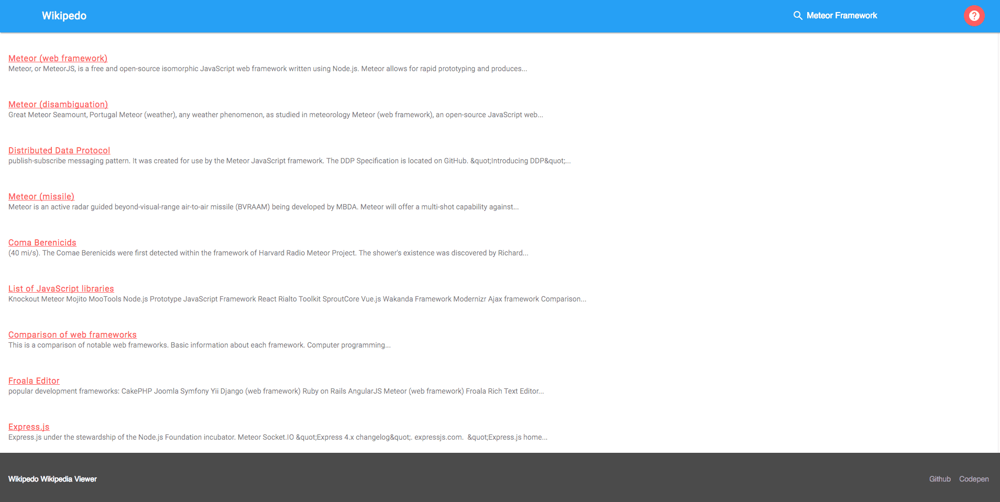

# Wikipedo
A Wikipedia viewer. Built for FreeCodeCamp.

## Screenshot

## Stack
- Frontend UI library: [Moon](http://moonjs.ga/) - *Like Preact for React but for Vue.*
- Design Library: [Material Design Lite](https://getmdl.io/) - *A very simple and lightweight material design library.*
- Build Tool: [Pingy](https://pin.gy/cli/) - *Zero-configuration build tool.*
- Package Manager: [Yarn](https://yarnpkg.com/en/) - *Like on NPM on steroids.*
